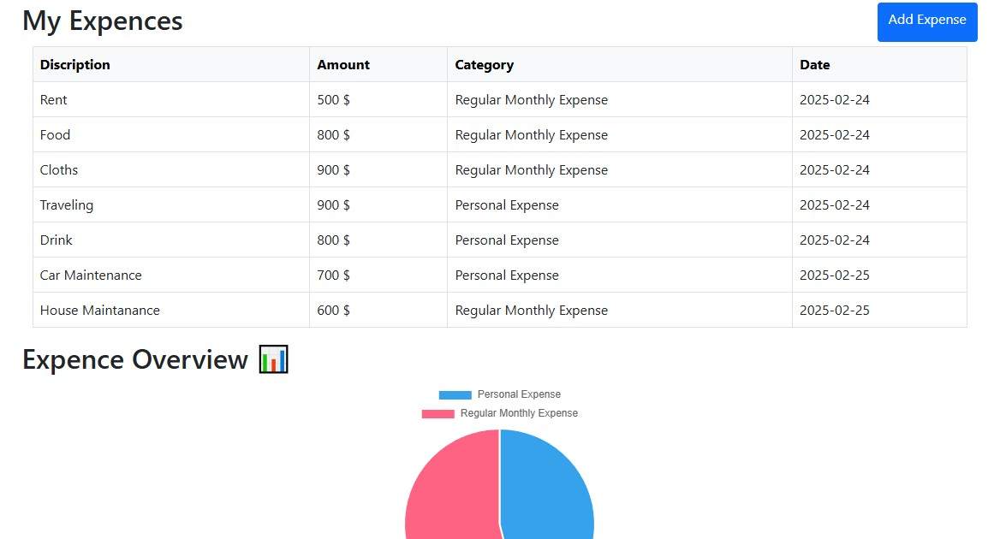

# 💰 Finance Expense Tracker  

A simple **Finance Expense Tracker** built with **ASP.NET Core MVC** to manage and track daily expenses. Users can **add, view, and categorize** expenses easily.

## 🚀 Features  
✅ Add and view expenses  
✅ Categorize transactions  
✅ Store expense data in SQL Server  
✅ User-friendly interface  

## 🛠️ Technologies Used  
- ASP.NET Core MVC  
- Entity Framework Core  
- SQL Server  
- Bootstrap (for UI)  

## 🎥 Video Demo  
  
